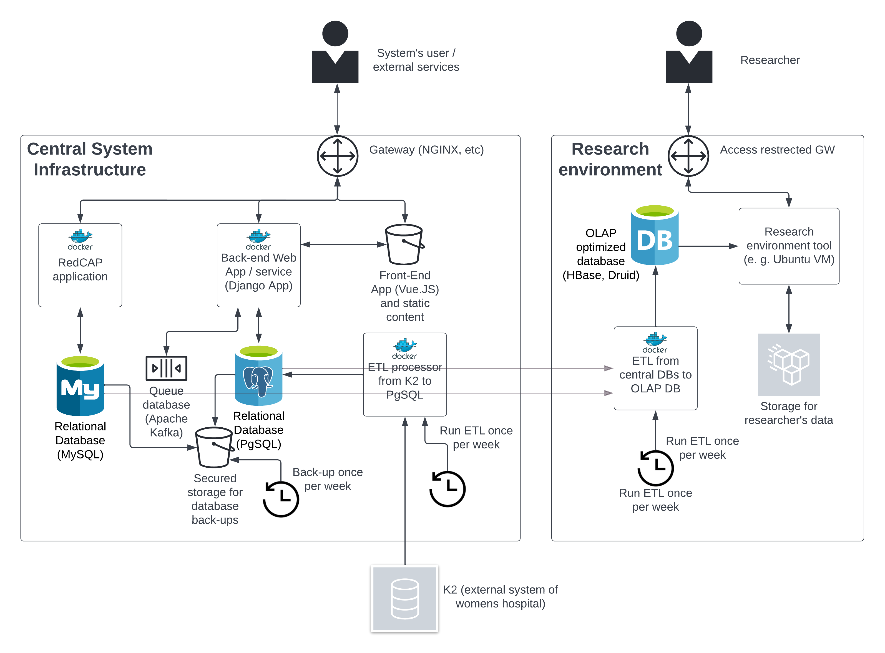

# Introduction

## Purpose and scope
This document describes the overall logic of DevOps infrastructure for the C-GULL project.

Author: David Salac

Organization: Liverpool City Region Civic Data Cooperative (University of Liverpool)

## Infrastructure overview
The following figure shows the main components of the C-GULL project. The whole project is split into a central part and a research environment. The central part is a web application responsible for the collection of data from participants (used by nurses) and management of the study. The research environment part is for researchers who analyze data collected in the study.

Note: K2 is an external system provided by the Women's Hospital Trust.

# DevOps infrastructure requirements

## General requirements
| ID | Requirement |
| --- | --- |
| G010 | Infrastructure shall provide storage for Docker containers (aka storage). |
| G020 | All interactions between the system and external services or users shall be encrypted (via HTTPS). |
| G030 | All parts shall be available nonstop (24/7) in probability quantile 0.99 |

## Central System requirements
| ID | Requirement |
| --- | --- |
| C010 | Central System shall comprise Gateway, RedCAP instance, Back-End service, Static Content Storage, MySQL database, PgSQL database, Queue database, and ETL service for fetching data from K2. |
| C020 | Gateway shall provide access to anybody with credentials (a Back-End web service manages the authorization process); there shall be no IP-based restrictions, geographical restrictions, etc. |
| C030 | RedCAP instance shall be a Docker image pulled from the storage. It is directly accessible from Gateway (therefore, the user can access it directly). |
| C040 | Back-End Service shall be a Docker image running (TBD) a Django instance pulled from the storage. It is directly accessible from Gateway (therefore, the user can access it directly). |
| C050 | Static Content (Front-End) storage shall be directly accessible from Gateway (therefore, the user can access it directly). It provides and stores static content (like the VueJS-based front-end). | 
| C060 | Static Content (Front-End) storage shall be fully accessible and editable from the Back-End Service (acting as static content storage for storing pictures, etc.). |
| C070 | Relational Database for Back-End Service shall be a PostgreSQL instance. Note: it would be nice to have something like managed SQL server on AWS (we do not need any extension of pure PostgreSQL). |
| C080 | Relational Database for Back-End Service shall be regularly backup - up at least once a week, and data shall remain in backup storage at least for one month. |
| C090 | Relational Database for Back-End Service shall be visible for Back-End Service, Research Environment's ETL service, and Backup utility (whatever it is). |
| C100 | Relational Database for RedCAP Service shall be a MySQL instance. Note: it would be nice to have something like managed SQL server on AWS. |
| C110 | Relational Database for RedCAP Service shall be regularly backup - up at least once a week, and data shall remain in backup storage at least for one month. |
| C120 | Relational Database for RedCAP Service shall be visible for RedCAP Service, Research Environment's ETL service, and Backup utility (whatever it is). |
| C130 | Queue Service shall be an Apache Kafka instance. Note: the primary function of this instance is to handle notifications for users, failed log-in attempts and similar auxiliary functions. Note: it does not need to be backup. |
| C140 | Queue Service shall be visible to Back-End Service only. |
| C150 | Central System ETL Processor from K2 to PostgreSQL shall be a Docker container instance pulled from the storage. Note: the main purpose of this component is to pull data (newcomers) from the K2 system. |
| C160 | Central System ETL Processor from K2 to PostgreSQL shall run once a week. Note: it would be nice if we could spin off this container just for this task, so we do not pay for it permanently. |
| C170 | Central System ETL Processor from K2 to PostgreSQL shall have only rights (visibility) to access PostgreSQL and K2 Service (using encrypted connection - critical). |

## Research Environment (aka RE) requirements
| ID | Requirement |
| --- | --- |
| R010 | The RE Gateway shall provide access only to white-listed IPs (University Liverpool VPN). |
| R020 | The RE Gateway shall provide access only to users with valid credentials (Note: it might be helpful to require a certificate to access). |
| R030 | RE OLAP Database shall store information fetched from Central System (ready for analytical queries). |
| R040 | RE ETL from central DBs to OLAP DB shall be a Docker container instance pulled from the storage. Note: the primary purpose of this component is to fetch data from the RedCAP and Web Service databases for analytical purposes. |
| R050 | RE ETL from central DBs to OLAP DB shall run once a week. Note: it would be nice if we could spin off this container just for this task, so we do not pay for it permanently. |
| R060 | RE ETL from central DBs to OLAP DB shall have only rights (visibility) to access Research Environment Tool and databases (RedCap and Web Service databases). |
| R070 | RE Tool instance shall be an instance that provides tools for researchers to process data in the OLAP database. Note: it is to be decided what exactly it is, but it might be a Ubuntu-based virtual machine with preinstalled software for manipulation of data in OLAP DB. |
| R080 | RE Tool instance shall be directly accessible through RE Gateway and visible to RE Storage. |
| R090 | RE Storage shall provide standard storage for RE Tool. Note: it might be disk storage for the virtual machine to store the user's data. |
