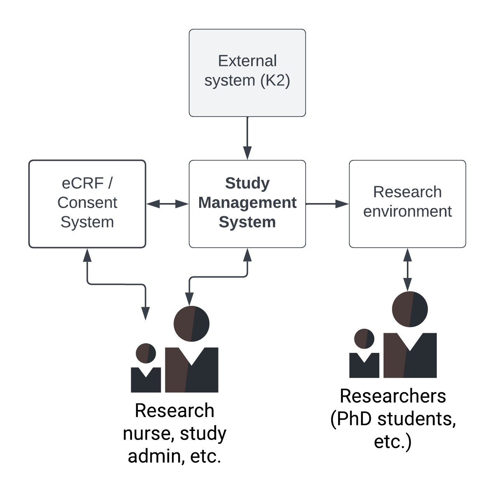
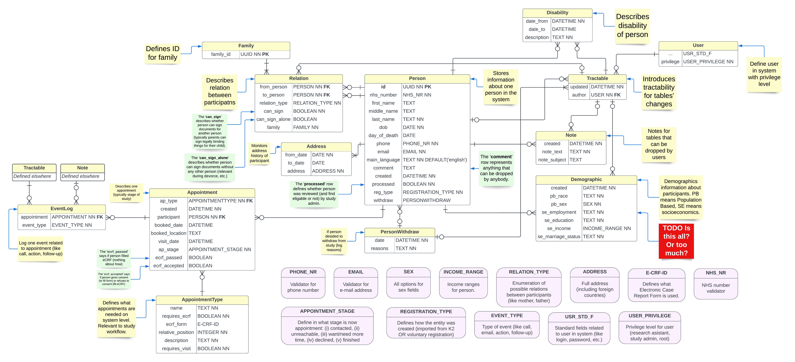

# Introduction

## Purpose
This document is the Software Requirements Specification for the C-GULL Study Management System.

## Scope
This document describes software requirements as defined in section 8.4 of ISO/IEC/IEEE 29148:2018(E) standard.

Author: David Salac

Organization: Liverpool City Region Civic Data Cooperative (University of Liverpool)

Version: 0.0.1
## Product overview
C-GULL Study Management System (abbreviated as SMS) is the information system that helps to handle organizing participants of the study and stores important information about participants and about events related to each participant (like appointments, calls, notes). Children Grown-Up in Liverpool (C-GULL) is a longitudinal study focused on women who are pregnant for the first time. The estimate number of participants is 10000. The estimated number of contacted people is 30000. Technically, it is a web application that interacts with other components as visualized in the Figure 1.

Figure 1: Position of Study Management System among other components

The SMS also provides helpful functionality that makes study run smoothly (like printing of labels for samples or generating of Family IDs). It interacts with external entities: K2 system that is used for import of potential participants; eCRF (probably REDCap) that is used for consent forms, and research environment database that stores data for further analysis.

# System requirements

## Functions
### Overall composition
The main functional parts of the system shall be Participant subsystem, Appointment subsystem, and Administration subsystem.

### Participant subsystem
The participant subsystem shall store and handle information about all potential and confirmed participants of the study and provide functionality CRUD to handle them.

The participant subsystem shall automatically import all potential participant using the external system called K2 once a week.

The participant subsystem shall allow to insert a voluntary participant manually using the front-end interface (meaning that mothers can register online on voluntarily base).

The participant subsystem shall store (and handle) information about each person that includes NHS number, ID in the system, full name of person, date of birth, day of death (if applicable), phone number, email address, main language, processed flag, and other things described separately in this document.

The participant subsystem shall store (and handle) relationship between participants defining important relations between participants (like who is mother, father). It also shell contains information about who is entitled to sign consents for the person (if applicable, typically when the participant is infant).

Selected relationships between participants shall define family entity (which shall define Family ID) – proper relations defining family are selected manually.

Processed flag shell be set to true if person is found either eligible or noneligible for the study, or to false if person was not reviewed yet by study administrator.

If the person is found eligible, then the first (empty) Appointment shall be created by the Appointment subsystem.

The participant subsystem shall store notes (defined in the separate subsection) related to each person.

The participant subsystem shall store address history related to each participant (from what time to what time and where a participant lives).

The participant subsystem shall store disability history related to each participant – what is the disability, when it started and finished (if applicable).

The participant subsystem shall store demographic history related to each participant (TODO: define what exactly to store).

The participant subsystem shall store information about withdrawal from study related to participants that opt-out of study (this includes date and reason why is person out).

The system shall generate PDF file (label) with person ID ready for printing.

### Notes
Notes shall be related to one entity (like Participant, Appointment) – this entity shall have none, one or many notes.

Each note shall contain information about the author of the note (User of the system), last update, date of creation, subject (if applicable) and actual text of the note.

### Tractability
All important entities in the system shall be tractable – meaning that the history of updates is stored – especially who performed update (which User) and when.

### Appointment subsystem
The appointment subsystem shall manage appointments related to each participant and defines study workflow (study steps).

The appointment entity shall be composed of appointment type, date and time of creation, participant (person in participant subsystem), booked date (if applicable), booked location (if applicable), date of visit (if applicable), appointment stage, flag indicating the eCRF is completed (if applicable), another flag indicating the consent (eCRF) is given (if applicable). 

The appointment type shall define steps of the study (therefore contains the relative position of appointment among others), indicate whether eCRF (or consent) is required at this appointment, contains reference to eCRF (or consent) form (if applicable), has flag indicating if a visit is required by participant, contains the name and description of appointment.

The appointment entity shall be related to event logs that shall store all events that has taken place (like phone calls, emails, action, follow-up) related to appointment.

The event log shall store notes related to each log where applicable.

The appointment stage shall describe in what situation the appointment is, the values are: contacted, unreachable, want or need more time, declined, finished (indicating that the appointment is closed).

### Administration subsystem
The administration subsystem shall be related to actual management of the study. 

The administration subsystem shall operate with users in three tires: root (without any limitations), research administrator, research assistant (midwife, research nurse).

## Performance requirements
The latency in communication between internal back-end components shall not exceed 0.2 seconds (at probability quantile 0.99).

The latency in communication between front-end clients located in UK and back-end services shall not exceed 1 second (at probability quantile 0.6).

## Usability requirements
The system front-end shall be optimized for mobile usability following ISO 9241 and ISO 25062 standards.

The system front-end shall meet legal requirements for cookie permissions, privacy statement, and accessibility statement.

## Accessibility requirements
The system front-end shall be optimised for accessibility following the international WCAG 2.1 AA accessibility standard.

## Interface requirements
System back-end shall implement a RESTful interface.

The system shall use token-based authentication.

## Logical database requirements
The following (Figure 2) represents the overview of database logic.

Figure 2: Simplified ERA model of database.

## Design constraints
The system shall operate with user data under constraints defined by GDPR.

The system shall process sensitive data which requires to follow strict security standards.

## Software system attributes
The system shall be available 99.5 per cent of the time.

The system back-end shall be available only through encrypted SSL protocol.

The system shall log every log-in attempt.

## Supporting information
The system shall be a standard web application with a strictly separated back-end and front-end.

The system shall be composed of a public front-end interface, administrator control panel, and RESTful back-end service on a high level.

# Appendices
## Acronyms and abbreviations
**CRUD:** Create, Read, Update, Delete

**SMS:** Study Management System
